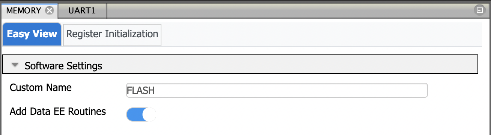
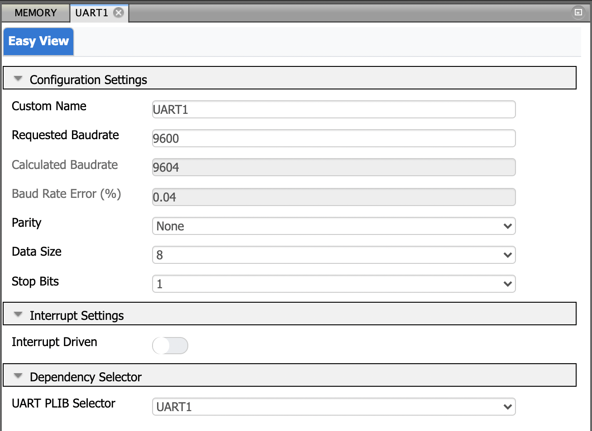
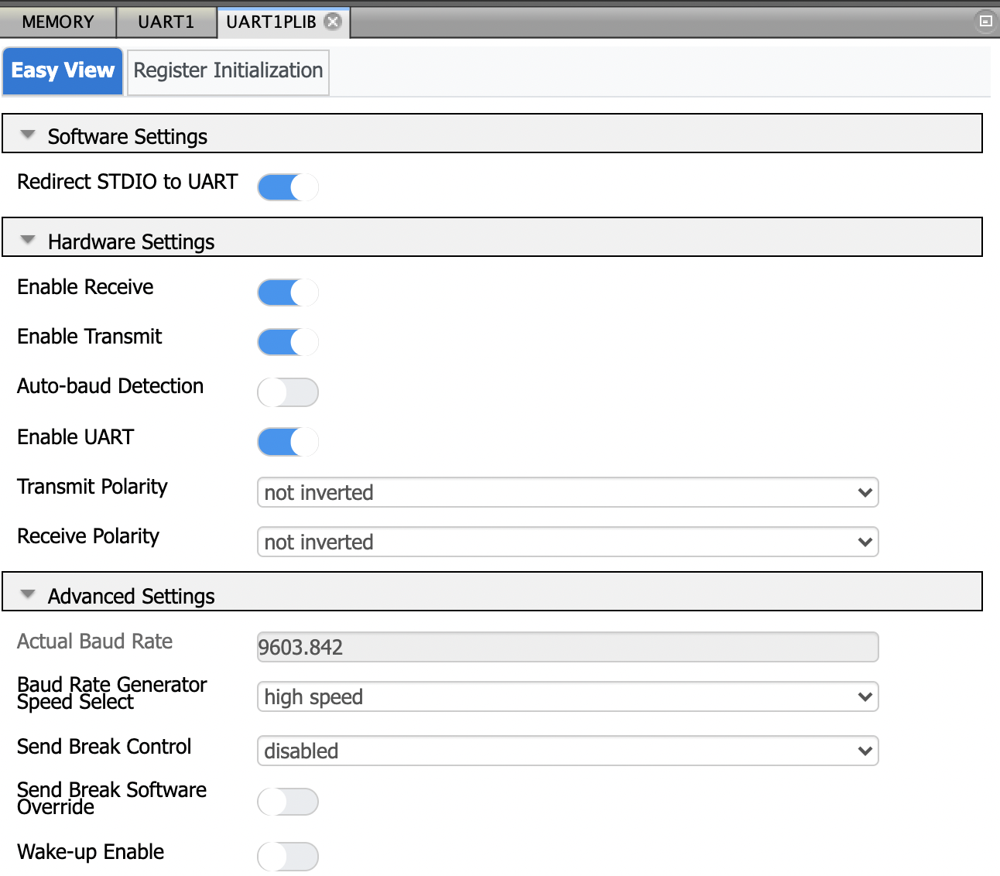
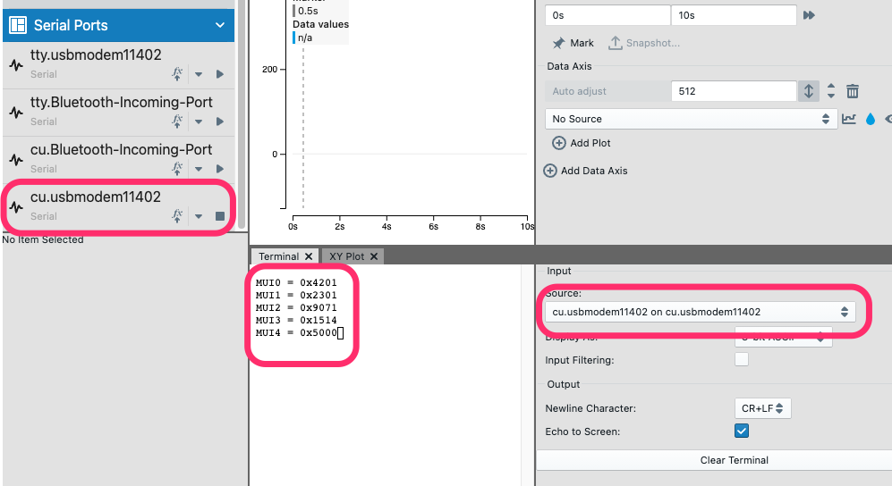

# Reading the Microchip Unique Identifier (MUI) on the PIC18-Q43 family of devices

This code example uses the memory driver generated using the Melody library to read the Microchip Unique Identifier (MUI) number from the microcontroller's memory. The MUI is a unique number that is encoded during final manufacturing individually on every device. This allows for unique device tracking by the application manufacturer.

## Related Documentation

  - [PIC18F-Q43 Family Product Page](https://www.microchip.com/en-us/products/microcontrollers-and-microprocessors/8-bit-mcus/pic-mcus/pic18-q43?utm_source=GitHub&utm_medium=TextLink&utm_campaign=MCU8_MMTCha_MPAE_Examples&utm_content=pic18f57q43-unique-identifier-mplab-melody-github)
  - [PIC18F57Q43 Datasheet](https://ww1.microchip.com/downloads/en/DeviceDoc/PIC18F27-47-57Q43-Data-Sheet-40002147F.pdf?utm_source=GitHub&utm_medium=TextLink&utm_campaign=MCU8_MMTCha_MPAE_Examples&utm_content=pic18f57q43-unique-identifier-mplab-melody-github)
  - [PIC18F57Q43 Curiosity Nano User Guide](https://ww1.microchip.com/downloads/en/DeviceDoc/PIC18F57Q43-Curiosity-Nano-HW-UserGuide-DS40002186B.pdf?utm_source=GitHub&utm_medium=TextLink&utm_campaign=MCU8_MMTCha_MPAE_Examples&utm_content=pic18f57q43-unique-identifier-mplab-melody-github)

## Software Used

- MPLAB® X IDE 6.0.0 or newer [(MPLAB® X IDE 6.0)](https://www.microchip.com/en-us/development-tools-tools-and-software/mplab-x-ide?utm_source=GitHub&utm_medium=TextLink&utm_campaign=MCU8_MMTCha_MPAE_Examples&utm_content=pic18f57q43-unique-identifier-mplab-melody-github)
- MPLAB® XC8 2.35.0 or newer compiler [(MPLAB® XC8 2.35)](https://www.microchip.com/en-us/development-tools-tools-and-software/mplab-xc-compilers?utm_source=GitHub&utm_medium=TextLink&utm_campaign=MCU8_MMTCha_MPAE_Examples&utm_content=pic18f57q43-unique-identifier-mplab-melody-github)
- MPLAB® Code Configurator (MCC) 5.1.2 or newer [(microchip.com/mplab/mplab-code-configurator)](https://www.microchip.com/mplab/mplab-code-configurator)
- Microchip PIC18F-Q Series Device Support (1.13.211) or newer [(packs.download.microchip.com/)](https://packs.download.microchip.com/)

## Hardware Used

- PIC18F57Q43 Curiosity Nano [(DM164150)](https://www.microchip.com/en-us/development-tool/DM164150)

## Setup

The PIC18F57Q43 Curiosity Nano Development Board is used as the test platform. It has an onboard programmer/debugger that acts as an UART to USB convertor so no further hardware is needed.  

The following configurations must be made for this project:

| Pin | Configuration            |
| :-: | :------------:           |
| RF0 | UART TX PIN              |
| RF3 | Digital Output for LED   |
| RB4 | Digital Input for Switch |

## MCC Settings:

This application uses the Memory and the UART driver from MCC. The following screenshots illustrate the settings from MCC.

### Memory Module
 

### UART Module
 
 

## Operation

When the cnano board is programmed, the firmware reads the MUI and stores it in an array. Every time the push button (SW0) is pressed, the MUI is printed on the UART which can be observed on the Data Visualizer. The LED state toggles every time the push button is pressed for visual confirmation.

 

## Summary

This project demonstrates how to read the Microchip Unique Identifier (MUI) from the device's memory and display it using the UART module and the Data Visualizer. The MUI is helpful with uniquely identifying the device in a given application.